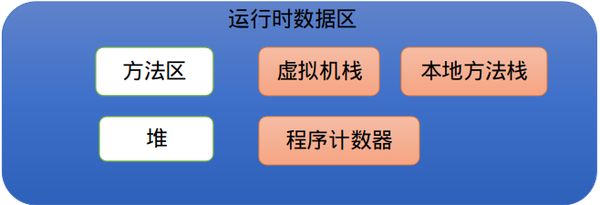
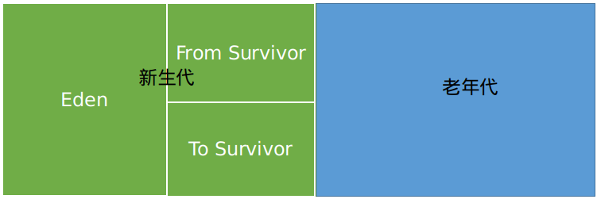

## I.内存区域

Java进程的内存区域分为：方法区、堆、虚拟机栈、本地方法栈、程序计数器。如下图：

其中方法区和堆是所有线程共享的区域，虚拟机栈、本地方法栈、程序计数器是线程私有的。

1. 方法区：用于存储已被虚拟机加载的类型信息、常量、静态变量、即时编译器编译后的代码缓存等数据。方法区亦称为元空间（Meta Space）。常量池属于方法区的一部分，用于存放编译期产生的各种字面常量和符号引用。当方法区的空间不能满足新的内存分配需求时，抛出OutOfMemoryError错误。

   字符串常量池属于常量池的一部分，在Java7之后，字符串常量池已挪到堆中。

2. 堆：用于存放对象实例。基于垃圾收集器分代收集的理论，堆通常被划分成如下的区域：

   

   新生代中的对象朝生夕灭，老年代中的对象存活时间通常更久。不过，近几年的多款垃圾收集器设计并不遵循分代收集理论（例如G1收集器、Shenandoah收集器、ZGC收集器等），因此对于这些新颖的收集器，以上堆的分区并不适用。

3. 虚拟机栈：生命周期与线程一样，其描述的是Java方法执行的线程内存模型。每个Java方法执行的时候，Java虚拟机都会创建一个栈帧，用于存放局部变量表、操作数栈、动态链接、方法出口等信息。一个方法被调用至执行完毕的过程，就对应了一个栈帧的入栈和出栈。

   虚拟机栈有两种异常。如果线程请求的栈深度大于虚拟机允许的栈深度，抛出StackOverflowError错误。如果虚拟机栈的容量允许动态扩展，当扩展时无法请求到足够的内存时抛出OutOfMemoryError错误。

4. 本地方法栈：本地方法栈的作用与虚拟机栈的作用类似，只不过虚拟机栈服务于Java方法，而本地方法栈服务与native方法。本地方法栈也会抛出StackOverflowError和OutOfMemoryError错误。

5. 程序计数器：程序计数器（PC）保存下一条待执行指令的地址。

6. 直接内存：直接内存不属于Java进程运行时的数据区，该部分内存属于物理内存的一部分，Java中可以使用Native函数库分配直接内存。在进行虚拟机内存规划时应当考虑这部分内存。

## II.内存区域调整参数

| 参数                    | 使用及解释                                             |
| ----------------------- | ------------------------------------------------------ |
| -Xms                    | -Xms10M 堆内存最小值设为10MB                           |
| -Xmx                    | -Xmx10M 堆内存最大值设为10MB                           |
| -Xss                    | -Xss128K 虚拟机栈的容量设为128KB                       |
| -XX:MetaspaceSize       | -XX:MetaspaceSize=10M 元空间容量大小设为10MB           |
| -XX:MaxMetaspaceSize    | -XX:MaxMetaspaceSize=10M 元空间最大容量设置为10MB      |
| -XX:MaxDirectMemorySize | -XX:MaxDirectMemorySize=10M 最大的直接内存容量设为10MB |
|                         |                                                        |

关于虚拟机栈的大小说明：如上述表格中，-Xss128K限制每个线程的栈容量为

128KB。当一个线程执行的方法数量太多导致栈帧数量增多，而每个栈帧占用一定的内存大小，当虚拟机栈不能够再容纳任何栈帧时会抛出StackOverflowError错误。

## III.垃圾回收

无用的对象需要被垃圾收集器回收，而什么样的对象可以称之为无用的对象？在《深入理解Java虚拟机》第三版中提到了两个算法用来标记对象是否为无用对象：1.可达性分析算法 2.引用计数法。在主流虚拟机例如HotSpot虚拟机采用的是可达性分析算法。

1. **可达性分析算法**：通过一系列称为“GC Roots”的根对象作为起始节点集，从这些节点开始，根据引用关系向下搜索，搜索过程所走过的路径称为“引用链”，如果某个对象到GC Roots间没有任何引用链相连，则称对象是不可达的。

   可以作为GC Roots的对象

   1.1. 在虚拟机栈中引用的对象。譬如方法参数、局部变量、临时变量等。

   1.2. 在方法区中静态属性引用的变量。

   1.3. 在方法区中常量引用的对象。

   1.4. 在本地方法栈中引用的对象。

   1.5. Java虚拟机内部的引用，如基本数据类型对应的Class对象，一些常驻的异常对象（NullPointerException、OutOfMemoryError）、类加载器。

   1.6. 所有被同步锁（synchronized）持有的对象

   1.7. 反应Java虚拟机内部情况的JMXBean、JVMTI中注册的回调、本地代码缓存等。

2. **Java中的引用**

   2.1. 强引用：代码中的引用赋值，如 String s = "hello"；就是强引用。只要强引用关系还在，垃圾回收器就不会回收被引用的对象。

   2.2. 软引用（SoftReference）：用来描述一些有用但非必须的对象。在系统将要发生堆溢出前会将软引用的对象进行标记回收，如果回收完之后空间依旧不够用才抛出内存溢出异常。

   2.3. 弱引用（WeakReference）：也是用于描述一些有用但非必须的对象，比软引用更弱。弱引用的对象在下一次垃圾回收时就会被收走，无论空间是否够用。

   2.4.  虚引用（PhantomReference）：虚引用是最弱的一种引用关系。一个对象是否有虚引用的存在，完全不会影响其生存时间。为一个对象设置虚引用的唯一目的是为了能在这个对象被收集器回收时收到一个系统通知。

3. **对象的两次标记**

   如果一个对象到GC Roots没有任何的引用链，则对象会被进行第一次标记。随后对被第一次标记的对象集进行第二次标记，标记的条件是：是否有必要执行对象的finalize()方法。如果对象重写了finalize()方法,并且没有被虚拟机调用，这种情况视为有必要执行对象的finalize()方法。对于没有重写finalize()方法或者调用过finalize()方法的对象，可以称这类对象已“死”。

   对于有必要执行finalize()方法的对象，虚拟机会将其放到一个叫做F-Queue的队列中，等待由虚拟机创建的、低优先级的线程调用其finalize()方法。因此对象可以在finalize()方法中拯救自己（将自己与GC Roots 对象关联上）。

   虚拟机虽然会执行finalize()方法，但是并不保证会等待方法执行完成。

4. **回收方法区**

   4.1. 何时回收？

   4.2. 回收什么：无用的常量和类。

   无用的常量：如果常量池中存在一个常量，而当前系统中没有一个对象的值为此常量或者引用此常量。可以称这样的常量为无用的常量。

   无用的类：一个无用的类需要满足一下三个条件

   1).该类的实例已经全部被回收。

   2).加载该类的类加载其已经被回收。

   3).该类对应的java.lang.Class对象没有在任何地方被引用，无法在任何地方通过反射访问该类的方法。

   4.3. 怎么回收？

   HotSpot虚拟机提供了-Xnoclassgc、-Xclassgc参数控制对类的回收行为,前者表示不回收无用的类，后者反之。

5. **垃圾回收的类型**

   部分回收（Partial GC）:指目标不是收集整个Java堆的垃圾收集。分为下面三种：

   - 新生代收集（Minor GC/Young GC）：指目标只是新生代的垃圾收集。
   - 老年代收集（Major GC/Old GC）：指目标只是老年代的垃圾收集。目前只有CMS收集器会有单独收集老年代的行为。
   - 混合收集（Mixed GC）：指目标是整个新生代以及部分老年代的垃圾收集。目前只有G1收集会有这种行为。

   整堆收集（Full GC）：对整个堆和方法区的垃圾收集。

6. **垃圾回收算法**

   - 标记-清除：标记出需要回收的对象，清除对象。此算法容易造成内存碎片，不利于大对象的内存申请。

   - 标记-复制：将内存分为两个部分，每次只使用其中一个部分。每次对已使用的部分进行回收时，首先标记存活对象，然后将存活对象复制到另一部分未使用的区域，然后对之前使用的区域整个清除。

     HotSpot中的新生代收集器：Serial、ParNew将新生代内存分为三个区域：一个Eden区，两个Survivor区，并且比例默认为8:1:1 。当向新生代申请内存空间时，使用Eden区加一个Survivor区的空间存放创建的对象。而另一个Survivor区用于存放垃圾回收时存活的对象。

   - 标记-整理：标记整理算法标记阶段如同标记-清除算法，但后续的步骤是让所有存活对象向内存空间的一端移动，然后直接清除边界以外的内存。

7. 垃圾收集器

   | 收集器            | 算法      | 回收区域 | 组合                     |
   | ----------------- | --------- | -------- | ------------------------ |
   | Serial            | 标记-复制 | 新生代   | Serial Old               |
   | ParNew            | 标记-复制 | 新生代   | CMS                      |
   | CMS               | 标记清除  | 老年代   | ParNew                   |
   | Parallel Scavenge | 标记-复制 | 新生代   | Serial Old、Parallel Old |
   |                   |           |          |                          |
   |                   |           |          |                          |
   |                   |           |          |                          |

   Serial：适用于客户端Java应用

   ParNew：适用于服务端的Java应用

   CMS：使用-XX:+UseConcMarkSweepGC参数启用。启用后，默认的新生代组合是ParNew。

   ParNew + CMS的组合方案，JDK9之后不再推荐使用，使用G1收集器替代这个组合。

   Parallel Scavenge：关注的是吞吐量。推荐使用-XX:+UseAdptiveSizePlicy参数开启自适应调节各参数以获得最好的吞吐量。使用-XX:MaxGCPauseMillis参数设置允许内存回收的时间不过该值，单位是毫秒。-XX:GCTimeRatio 参数表示垃圾收集时间占总时间的比率，参数的值在[1-99]之间。
   $$
   吞吐量 = （运行用户代码时间）/(运行用户代码时间+运行垃圾收集时间)
   $$
   

8. 