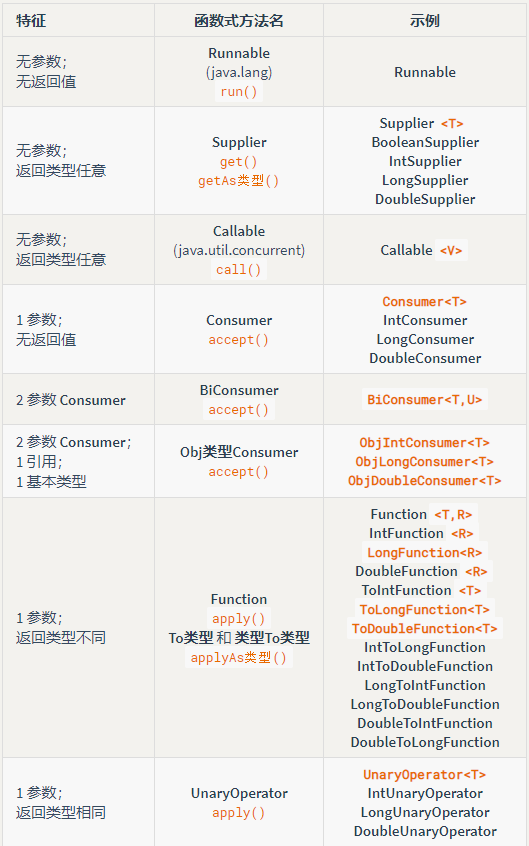
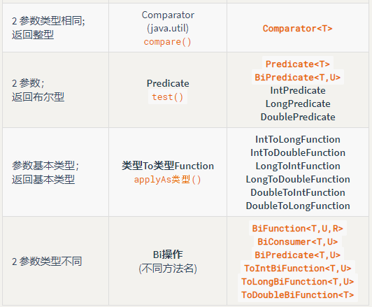

# Java8新特性学习

1. 函数式编程
2. Stream
3. Optional

## 函数式编程

函数式编程中，我们需要搞明白的问题是：谁调用函数？函数怎么实现？java8的做法是，用接口（interface）调用函数,函数的实现使用lambda表达式或者函数引用，这个接口通常只有一个函数，java把这个接口叫做函数式接口。

### lambda表达式

lambda表达式本身是函数的实现，比较直观的一种写法是：

```java
(args)->{statements;} //比较直观的看到参数和方法体
```

比如用lambda表达式重写Runnable的run()方法：

```java
//使用lamda表达式创建线程
new Thread(()->{System.out.println("create thread use lamda");})
    .start();
```

### 方法引用

语法如下：

1. 类名::函数名
2. 对象名::函数名

使用方法引用时需注意方法是类的方法还是实例的方法，这个区别决定了如何选择上述的引用方式。

```java
public class Test {

    public static void testPrint1(String msg){
        System.out.println(msg+" use testPrint1");
    }

    public void testPrint2(String msg){
        System.out.println(msg+" use testPrint2");
    }

    public static void main(String[] args) {
        //使用"类名::方法名"进行引用
        Help help = Test::testPrint1;
        help.print("Help");

        //使用使用"类名::方法名"进行引用，略微复杂，因为引用的是实例的方法，所以需要提供一个实例
        Help2 help2 = Test::testPrint2;
        Test test1 = new Test();
        help2.print(test1,"Help2");

        //使用"对象::方法名"进行引用
        Test test = new Test();
        Help help1 = test::testPrint2;
        help1.print("Help");
    }
}

interface Help{
    void print(String msg);
}

interface Help2{
    void print(Test test,String msg);
}
```

除了使用接口对静态函数、实例函数进行引用之外，还可以对构造函数进行引用。例子如下：

```java
public class Test {

    public static void main(String[] args) {
        
        StudentMaker1 maker1 = Student::new;
        Student stu1 = maker1.makeStudent("name1");
        
        StudentMaker2 maker2 = Student::new;
        maker2.makeStudent("name2",20);
        
    }
}

class Student{
    String name;
    int age;

    public Student(String name, int age) {
        this.name = name;
        this.age = age;
    }

    public Student(String name) {
        this.name = name;
    }
}

interface StudentMaker1{
    Student makeStudent(String name);
}
interface StudentMaker2{
    Student makeStudent(String name,int age);
}
```

### 函数式接口

函数式接口指的是：接口中只有一个抽象方法，并且使用@FunctionalInterface注解标识了这个接口

Java8中函数编程思想体现在使用接口调用函数，而函数的实现可以使用lambda和函数引用来实现。开发中，我们可能会需要各种函数，比如没有返回值没有参数的函数、有两个参数并且有返回类型的函数...为了让我们更方便的进行函数式编程，JDK中内置了很多函数式接口，基本可以满足我们的使用。





### 高阶函数

产生函数的函数

```java
interface FuncSS extends Function<String, String> {
  
} 

public class ProduceFunction {
  
  //函数produce()的返回值是lambda表达式，即函数返回函数
  static FuncSS produce() {
    return s -> s.toLowerCase(); 
  }
  public static void main(String[] args) {
    //使用自定义的FuncSS接收produce()的返回值
    FuncSS f = produce();
    System.out.println(f.apply("YELLING"));
  }
}
```


### 函数组合

多个函数进行组合生成新的函数。

- f1.compose(f2)		//执行f2之后执行f1

- f1.andThen(f2)		//执行f1之后执行f2
- f1.and(f2)				//逻辑与
- f1.or(f2)					//逻辑或
- f1.negate()      	//逻辑否

```java
public class Test {

    static Function<String,String> f1 = s->s.toUpperCase();
    static Function<String,String> f2 = s->s.substring(2);
    static Function<String,String> f3= s->s.replace('S','*');
    static Function<String,String> f4= f1.compose(f2).andThen(f3);  //执行顺序：f2->f1->f3

    public static void main(String[] args) {
        System.out.println(f4.apply("test test test"));
        //运行结果：*T TE*T TE*T
    }

}
```


```java
public class PredicateComposition {
    
  static Predicate<String>
    p1 = s -> s.contains("bar"),
    p2 = s -> s.length() < 5,
    p3 = s -> s.contains("foo"),
    p4 = p1.negate();//.and(p2).or(p3);
    
  public static void main(String[] args) {
    Stream.of("bar", "foobar", "foobaz", "fongopuckey")
      .filter(p4)
      .forEach(System.out::println);
  }
}
```


## 流（Stream）

Stream用来将集合或者数组中的元素进行一系列的中间操作（元素过滤、元素排序、元素映射等），最后产出一个结果（转换为数组、集合等）

### 创建流的方式

- 第一种创建流的方式：使用Stream.of()方法

  ```java
  public static void testStreamOf(){    
      Stream<String> stringStream = Stream.of("he","llo"," world");
  }
  ```

- 第二种创建流的方式：调用集合的stream()方法

  ```java
  public static void testStreamMethod(){    
      List<String> strList = new ArrayList<>();    
      strList.add("he");    
      strList.add("llo");    
      strList.add("world");    
      Stream<String> stringStream = strList.stream();
  }
  ```

- 第三种创建流的方式：产生随机数流(IntStream,DoubleStream,LongStream)

  ```java
  public static void testRandomStream(){    
      Random r = new Random();    
      IntStream intStream = r.ints(4,3,10);
  }
  ```

- 第四种创建流的方式：实现Supplier接口,结合Stream.generate()方法生成流对象

  ```java
  //随机产生单词的类
  class Randomwords implements Supplier<String> {    
      private List<String> words = new ArrayList<>();    
      Random rand = new Random(47);    
      public Randomwords(String fname) throws IOException {        
          //将文件中的内容按行读到List中        
          List<String> lines = Files.readAllLines(Paths.get(fname));        
          //跳过第一行        
          for (String line : lines.subList(1,lines.size())) {            
              for (String word:line.split("[ .?,]+")){                
                  //把每行内容切割成单词并加入到words列表                			
                  words.add(word.toLowerCase());            
              }        
          }    
      }    
      @Override    
      public String get() {        
          return words.get(rand.nextInt(words.size()));    
      }
  }
  ```

  ```java
  public static void testSupplierAndGenerate() throws IOException {    
      Stream<String> stringStream = Stream.generate(new Randomwords("test.txt"));
  }
  ```

- 第五种创建流的方式：使用Stream.Builder

  ```java
  class FileToWordsBuilder {    
      Stream.Builder<String> builder = Stream.builder();    
      public FileToWordsBuilder(String fname) throws IOException {        
          //将文件的每一行读到内存中，跳过第一行，对每一行进行单词切割，并把单词加入builder列表   
          Files.lines(Paths.get(fname)).skip(1).forEach(line->{            
              for (String w : line.split("[ .?,]+"))                
                  builder.add(w);        
          });    
      }   
      public Stream<String> stream(){        
          return builder.build();   
      }
  }
  ```

  ```java
  public static void testStreamBuilder() throws IOException {    
      FileToWordsBuilder builder = new FileToWordsBuilder("test.txt");    
      Stream<String> stringStream = builder.stream();
  }
  ```

- 第六种创建流的方式：使用Arrays.stream(T[] arr)方法

  ```java
  public static void testArraysStream(){    
      int[] ints = {1,2,3,4,5,6,7};    
      IntStream integerStream = Arrays.stream(ints);
  }
  ```

### 流的中间操作

```java
//流的中间操作
public class Demo4 {    
    public static void main(String[] args) throws IOException {        
        //testPeek();        
        //testSorted();        
        //testDistinct();        
        //testFilter();        
        //testMap();        
        //testMapToInt();        
        //testFlatMap();    
    }    
    //peek()操作，对元素进行声明函数操作，用于查看不可用于修改    
    public static void testPeek() throws IOException {        
        new FileToWordsBuilder("test.txt").stream()                
            .limit(3).map(i->i+" ")                
            .peek(System.out::print)                
            .map(String::toLowerCase)                
            .peek(System.out::print)                
            .map(String::toUpperCase)                
            .forEach(System.out::print);    
    }   
    
    //sorted()排序操作    
    public static void testSorted(){        
        int[] arr = {2,4,1,3,8,4,3};        
        //1、默认不传比较器        
        Arrays.stream(arr).sorted().forEach(System.out::println);    
    }   
    
    //distinct()去除重复元素    
    public static void testDistinct(){        
        int[] arr = {2,4,1,3,8,4,3};     
        Arrays.stream(arr).distinct().forEach(System.out::println);    
    } 
    
    //filter(func())过滤掉不满足要求的元素    
    public static void testFilter(){        
        int[] arr = {2,4,1,3,8,4,3};        
        Arrays.stream(arr).filter(x-> x > 3).forEach(System.out::println);    
    }   
    //map(func()),对元素进行声明的函数中操作    
    public static void testMap(){        
        int[] arr = {2,4,1,3,8,4,3};        
        Arrays.stream(arr).map(n->n+1).forEach(System.out::println);    
    }  
    //mapToInt(),将元素转换为int类型    
    public static void testMapToInt(){        
        String[] strings = {"23","34","90"};   
        Arrays.stream(strings).mapToInt(Integer::parseInt)
            .forEach(n->System.out.format("%d ",n));    
    }    
    //flap(),流扁平化：对流中的每个元素创建一个满足指定要求的流。    
    public static void testFlatMap(){        
        int[] arr = {1,2,3};       
        Random random = new Random();        
        Arrays.stream(arr).flatMap(i->random.ints(i,5,10))        
            .forEach(n->System.out.format("%d ",n));        
        //最终会产生6个元素    
    }
}
```

### 流的终端操作

- 转化为集合

```java
public class Demo5 {   
    
    //toArray();将流转化为数组    
    static void testToArray(){        
        int[] rints = new Random(47).ints(0, 1000).limit(100).toArray();    
    }  
    
    //forEach(func())对每个元素执行指定操作    
    static void testForEach(){       
        new Random(47).ints(0, 1000).limit(100).forEach(System.out::print);    
    }  
    
    //由数组转换而来的stream转为list    
    static void testCollect(){        
    	int[] arr = {1,2,3};        
        ArrayList<Integer> list = Arrays.stream(arr)
            .collect(ArrayList<Integer>::new,ArrayList::add,ArrayList::addAll);    
    }    
    
    //由列表转换的stream转为list    
    static void testCollectorsToXXX(){       
        List<String> strings = new ArrayList<>();     
        strings.add("hello");      
        strings.add("world");        
        List<String> strings2 = strings.stream().sorted().collect(Collectors.toList());  
    }
}
```

- 分组后转化为Map对象

  Student的stream()方法可以随机产生Stream\<Student\>

  ```java
  public class Test {
  
      public static void main(String[] args) {
          testGroupBy();
      }
  	//学生类的属性：name,age,score
      //根据学生的分数，将学生分组，[90,100]区间：VeryGood,其他：NotBad
      //使用了Collectors.groupingBy(oneArg),此时键是lambda函数产生的，值则是当前流的元素
      static void testGroupBy(){
          Map<String,List<Student>> map = Student.stream()
                  .limit(10)
                  .collect(Collectors.groupingBy((stu)->{
                      if(stu.getScore() >= 90 && stu.getScore() <= 100)
                          return "VeryGood";
                      else{
                          return "NotBad";
                      }
                  }));
      }
      
      //Function.identity()产生map中的键，Collectors.counting()产生map中的值
      static void testGroupBy2(){
          Stream<String> fruitStream = Arrays.asList("apple","banana","apple")
              .stream();
          Map<String,Long> map = fruitStream
             .collect(Collectors.groupingBy(Function.identity(),Collectors.counting()));
          //结果：[apple:2,banana:1]
      }
      
          //组合属性进行groupBy(),需求：将成绩大于90并且age>20的列为"Top"组，剩余的列为"Other"组
      static void testGroupBy3(){
          Map<String,List<Student>> map = Student.stream()
                .limit(20).
                collect(Collectors.groupingBy(Test::byAgeAndScore));
      }
  
      static String byAgeAndScore(Student stu){
          if(stu.getScore() > 90 && stu.getAge() > 20){
              return "Top";
          }else
              return "Other";
      }
  
  }
  ```

  

## Optional类

将对象存储于Optional对象中，可以很方便的对对象进行判空，有效的简化代码（不再频繁使用if对null判断），优雅地解决了空指针问题。

### 创建Optional对象

```java
//使用Optional类中的三个静态方法创建Optional对象
static void testCreateOptional(){    
    //创建空的Optional对象，此对象总不含值，调用get()方法会报java.util.NoSuchElementException: No value present    
    Optional<String> strOpt = Optional.empty();    
    //创建具有value的Optional对象，不能使用null作为of()的参数，会报空指针异常，调用get()可以获得value    
    Optional<String> strOpt2 = Optional.of("a value");    
    //创建一个value为null或者非null的Optional对象    
    Optional<String> strOp3 = Optional.ofNullable(null);
}
```

### Optional的便捷函数

为了方便的测试Optional提供的方法，此处创建一个Student 类（这个类可以调用stream()方法获取一个随机产生的Stream\<Student\>对象）

```java
class Student{    
    String name;    
    int age;    
    public Student(String name, int age) {        
        this.name = name;        
        this.age = age;    
    }    
	//省略setter和getter方法  
    @Override    
    public String toString() {        
        return name;    
    }    
    private static Random r = new Random(47);    
    public static Student generateStu(){        
        int i = r.nextInt(4);        
        Student stu;        
        switch (i){            
            case 0:                
                stu = new Student("name0",20);break;            
            case 1:                
                stu = new Student("name1",20);break;            
            case 2:                
                stu = new Student("name2",20);break;            
            default:                
                stu = null;        
        }        
        return stu;    
    }    
    public static Stream<Optional<Student>> stream(){        
        return Stream.generate(Student::generateStu)
            .map(student -> Optional.ofNullable(student));    
    }
}
```

测试Optional对象的便捷的函数

```java
//测试ifPresent(func),orElse(otherObject),orElseGet(Supplier),orElseThrow(Supplier)
static void testOptioalMethods(){    
    //如果Optinal中的对象不为空，这三个函数都可以直接返回Optional中的对象
    //orElse(otherObject)：如果值存在则直接返回，否则生成 otherObject。
    //orElseGet(Supplier)：如果值存在则直接返回，否则使用 Supplier 函数生成一个可替代对象。 
    //orElseThrow(Supplier)：如果值存在直接返回，否则使用 Supplier 函数生成一个异常。
    Optional<Student> stuOpt = Optional.of(new Student("name0",20));    
    
    //由于stuOpt中有Student对象，因此下面可以取出Student对象并执行相关操作 
    stuOpt.ifPresent(item->System.out.println(item.getName()));    
    //由于stuOpt中有Student对象,因此下面返回的对象是“name0”的对象，不创建新的对象    
    Student stu = stuOpt.orElse(new Student("name1",20));    
    //由于stuOpt中有Student对象,因此下面返回的对象是“name0”的对象，不创建新的对象    
    Student stu2 = stuOpt.orElseGet(()-> new Student("name2",20));    
    try {        
        //由于stuOpt中有Student对象,因此下面返回的对象是“name0”的对象，不进入异常捕捉 
        Student stu3 = stuOpt.orElseThrow(()->new Exception("No Object In Optional")); 
    } catch (Exception e) {        
        System.out.println(e);    
    }    
    //经过测试：stu,stu2,stu3均指向同一个对象：name0    
    //如果stuOpt中没有对象，则stu->name1,stu2->name2,stu3->进入异常catch
}
```

此外，Optional对象还有一个isPresent()函数，返回值为boolean类型，用于判断Optional对象中是否有对象。

### 包装Optional流、解包装

上面的Student类中有一个stream()方法用于产生Stream<Optional\<Student\>> 流，下面的代码演示如何将Stream<Optional\<Student\>> 流转为Stream\<Student\>流

```java
//将普通对象的流包装成Optional流，并解包。
static void convertToOptionalStream(){    
    //此处得到的流是Optional<Student>流    
    Student.stream()            
        .limit(8)            
        .forEach(System.out::println);        
    //filter()过滤掉含空值的Optional<Student>对象，    
    // map()将Optional中的Student对象提取出来，最后得到Stream<Student>流    
    Student.stream()            
        .limit(8)            
        .filter(Optional::isPresent)            
        .map(Optional::get)            
        .forEach(System.out::println);
}
```


