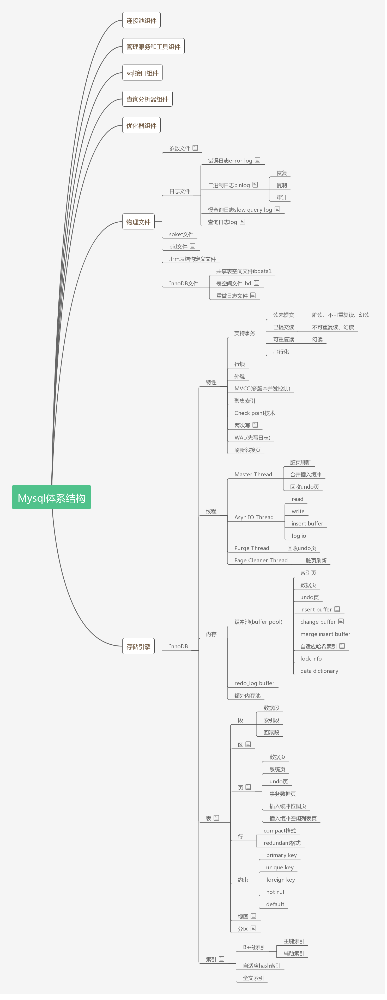
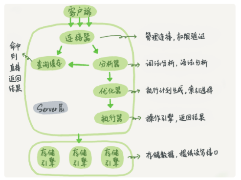
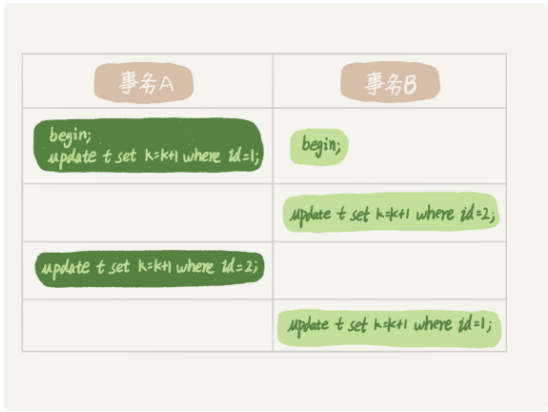

# Mysql学习笔记

## Mysql体系结构图

## 0.概念解释

InnoDB引擎层提供redolog,Server层提供binlog

redolog:记录在什么数据页上发生了什么修改

binlog:记录操作语句的原始逻辑

innodb_flush_log_at_trx_commit参数设置为1，事务的redolog提交之后记录会直接刷新到磁盘中

sync_binlog参数设置为1，事务的binlog会直接同步到磁盘中

mysql：WAL技术，先写日志后写磁盘

mysql最小的数据读取单位：页，每个数据页的默认大小16KB

**MVCC：**据库的多版本并发控制。通过在每次对记录更新时记录一条回滚操作，最新值可以通过回滚操作回滚到之前的某个状态。

**mysql语句执行流程：**

## 1.事务

事务：引擎层提供的功能

事务隔离的实现：

事务的四个特性：

1. **原子性**：操作这些指令时，要么全部执行成功，要么全部不执行。只要其中一个指令执行失败，所有的指令都执行失败，数据进行回滚，回到执行指令前的数据状态
2. **一致性**：事务的执行使数据从一个状态转换为另一个状态，但是对于整个数据的完整性保持稳定。
3. **隔离性**：隔离性是当多个用户并发访问数据库时，比如操作同一张表时，数据库为每一个用户开启的事务，不能被其他事务的操作所干扰，多个并发事务之间要相互隔离。
4. **持久性**：当事务正确完成后，它对于数据的改变是永久性的

mysql事务隔离级别：

- 读未提交：读到未提交的事务中的内容。
- 读提交：读的时候能看见的内容绝对是已经提交过的事务。
- 可重复读：事务在整个期间（事务开始和事务提交之间）看到的数据始终是一直的。
- 串行化：每个事务之间是串行方式执行的。

**事务隔离级别的实现机制：**对于”读提交“级别，在一个事务中，进行多次查询时，每次查询都会创建一个视图，因此看到的数据是每次查询时数据库中已经提交的数据。对于”可重复读“，事务在开始时会创建一个视图，然后在整个事务期间，都只能看到这个视图的数据，因此在这个事务进行过程中看不见别的事务提交产生的数据。对于”串行化“，事务直接通过加锁的方式避免多个事务并行对表进行操作。

## 2.索引

InnoDB引擎采用B+树作为索引的存储结构，好处是减少了磁盘IO时间，因为B+树的可以实现使用很少的层就能存储大量的数据，而每遍历树的一个节点都是对磁盘IO操作。在B+树中，只有叶子结点存储真正的数据，其他非叶子结点存储索引的值。

**联合索引**是指在多个字段上建立一个索引，只要符合最左前缀原则都可使联合索引生效，比如联合索引（a,b,c）,查询时用到(a),(a,b),(a,b,c)都是可以使得索引生效的，而(b,c),(b),(c)这种组合不能生效。

**覆盖索引**可以解决回表问题，要做到覆盖索引需要从sql语句和索引层面实现，原理就是在查找非主键索引时就可以获取到需要的字段，这时就不需要再到主键索引树上查询。

读提交和可重复读使用视图来实现事务的隔离，读提交在每个sql语句执行时创建，可重复读在事务开始时创建视图，后面的操作都是基于视图上的数据。

**普通索引和唯一索引的选择**：唯一索引最突出的优点是能够保证字段不会重复，如果有这个需求，并且在业务代码中不保证字段一定是唯一的前提下，使用唯一索引可以实现这个功能。不过，当在业务代码中能保证字段的插入是不会重复的情况下，对于插入之后短时间立即读取内容则使用unique索引效果会好一些，而对于主要是进行更改记录（插入、更改），查询较少的情况下，使用普通的索引效果更好，因为普通索引可以使用changeBuffer,可以将更改操作记录到内存中而不用每次都要从磁盘调出对应的数据页。

## 3.MySQL锁

**全局锁(对整个数据库实例加读锁)**

**FTWRL**:整库加读锁，对表的增删改和对库的修改都会被阻塞。只有查询的操作可以得到执行。使用场景是对于不支持数据库事务的引擎，如果需要备份数据，可以使用这个命令。不过如果数据库支持事务，比如InnoDB,那么进行数据库备份就不需要对整库加锁，将事务级别设置为**可重复读**，再使用：**mysqldump –single-transaction**，进行备份。

**表级锁(读写锁实现)**

- 表锁：加锁  **lock tables [table-name] read/write**;解锁 **unlock tables**;使用lock tables [table-name] read命令之后，当前线程只允许进行读操作，使用lock tables [table-name] write 命令之后，当前线程可进行读和写操作。需要强调的是，读锁与读锁之间不互斥，读锁和写锁互斥，写锁和写锁互斥。
- MDL：全称 metadata lock,元数据锁，Mysql5.5版本之后引入的。不需要显示使用，当访问一个表的时候自动加上。也是分读锁和写锁，当对表进行数据的增删改查时使用读锁，当对表结构进行更改（比如增加字段，修改字段名称等）时加写锁。MDL在sql语句执行时获取，在事务提交之后才释放。

**行锁（读写锁实现）**

两阶段锁：在InnoDB事务中，行锁是在需要的时候加上的，但并不是不需要了就立刻释放，而是要等到事务提交之后才释放，这就是两阶段锁协议。

行锁即加在行记录上的锁，对行进行修改是加写锁，读取时加写锁。

事务中死锁问题：以行锁为例

如上图，两个事务互相等待对方占有的行锁，发生了死锁。解决方法如下：

1. 配置innodb_lock_wait_timeout最大等待时间，第一个等待超过这个值的线程主动退出，其他线程获取到锁。比如innodb_lock_wait_timeout=50，当事务A等待超过50秒之后，主动退出。此时事务B得到锁。
2. 开启锁检测：innodb_deadlock_detect=on;当发生了死锁，事务可以自行检测到并通过回滚某个处于死锁中的事务快速解决死锁问题，而当多个线程都在进行死锁检测时会消耗大量CPU。解决死锁问题的主要方向，就是控制访问相同资源的并发事务量。

可重复读的核心是一致性读，事务更新数据时只能使用当前读策略，当前读是指获取数据的最新版本。如果当前记录的行锁被其他事物持有，则需要等待。

更新数据时使用当前读策略，即在最新的及记录上进行修改，保证了多个事务同时修改同一行记录时不丢失更新。在一个事务中，数据的最新值不一定能被当前事务读到，而如果对select语句进行如下增添则会同样达到当前读的效果：select ... from ... where ... lock in share mode,或者 select ... from ... where ... for update，对应的锁操作就是前者加了共享锁，后者加了排他锁。

在读提交和可重复读情况下，事务的一致性快照创建的时间不一样，对于读提交，一致性快照在每个语句执行前创建，而对于可重复读，只要在事务开始时创建一致性视图，则在整个事务期间，一致性视图都是不变的。

一致性读：对应一致性视图上面的普通查询操作

当前读：总是读取已提交的最新版本。

对于可重复读，查询只承认在事务启动之前已经提交完成的数据。

对于读提交：查询只承认在语句启动前就已经提交完成的数据。

## 4.Buffer Pool

- **change buffer**:这片缓冲区的作用是，对于更改操作（增删改），如果要修改的记录所在的页不在内存中，则先将修改操作记录在缓冲区中，等后续有查询操作时再从数据库中把对应的页读入内存，并合并之前记录的更改操作。除此之外系统也有线程来定期合并修改记录和数据库中的页。这片内存区域的大小有具体的参数可调。

--------------------------------------------------------------------------------------------------------------------------------

**28、读写分离有哪些坑**

过期读：主从同步发生延迟，主库的更新没有立即同步到从库，在从库读取数据时读到的不是最新状态。

解决办法1：强制走主库。缺点是如果大量的查询都从主库读取，主库的压力变大。

解决办法2：从从库读取时，先sleep一秒，再读取数据。缺点：如果主从延迟超过1秒，还是会发生过期读。

解决办法3：判断主从无延迟，有以下三个方法。

1. 通过show slave status  查看 seconds_behind_master的值是否等于0。

 	2. 通过show slave status 对比Read_Master_Log_Pos和Exec_Master_Log_Pos，前者表示当前读到的主库的最新位点，后者表示从库当前执行到的位点，若相同证明无延迟。
 	3. 通过show slave status 查看Retrieved_Gtid_Set和Executed_Gtid_Set。
 	4. 在以上的基础之下，启用semi-syn配置，semi-syn配置的作用是，一个事务被从库确认收到之后，主库向客户端返回事务执行成功。

解决办法4：等主库位点。客户端执行一个事务成功之后，在主库执行show master status,获取当前的file和pos,然后再到从库执行select master_pos_wait(File, Position, time_out)；如果返回值>=0,则证明在此从库能读取到需要的数据。

解决办法5：等主库gtid_set。客户端执行一个事务成功之后，获得一个gtid,记为gtid1,然后在从库执行select   wait_for_executed_gtid_set(gtid1, time_out)；返回值是0，则可以在此从库查询。

以上所有解决方案，并不能保证一定可以在从库读取到最新的事务，只是提供了判断主从延迟的手段。

--------

**29、如何判断主库出问题了**

方法1：select 1 from  xxx。可以判断数据库进程是否在运行，但不能反映数据库具体状态。

方法2：执行一条更新语句。可以在数据中建一个用于测试数据库健康状态的表，向其填充数据，通过向这个表执行一条update语句可以大致判断数据库的健康状态。缺点是，虽然update语句执行成功，但是并不能反映数据库io资源使用情况，这样就会导致后续的查询由于数据库io资源占用太高，sql执行返回比较慢的情况。

方法3：查询数据库performance_schema.file_summary_by_event_name 表中记录的binlog 和 redolog的MAX_TIMER，根据这个值判断系统IO负载情况。