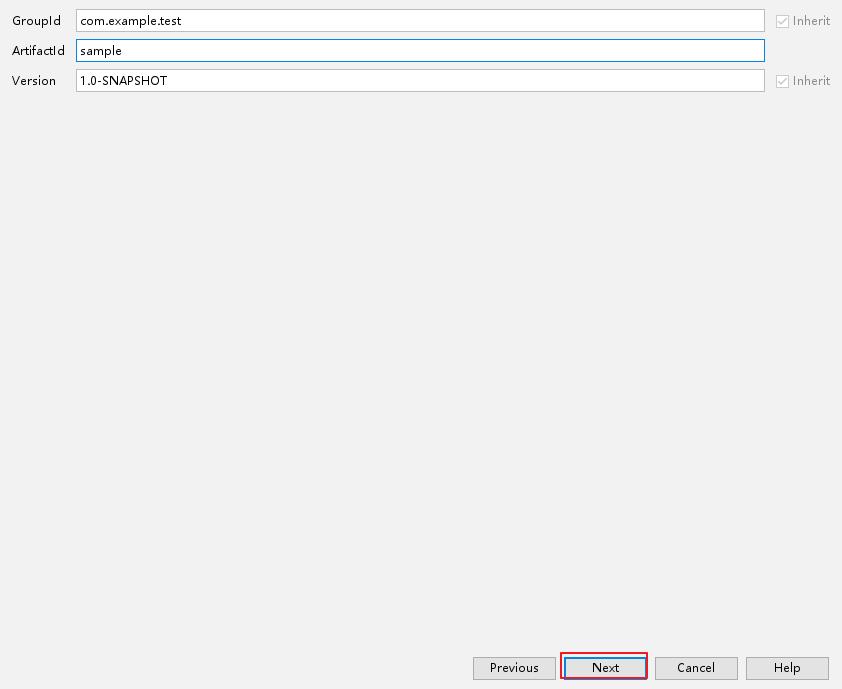
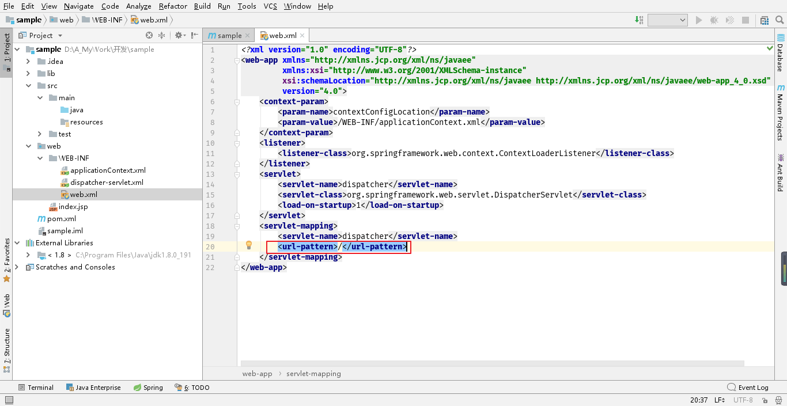

# Spring 实战note

### 一、Spring配置Bean
- **xml文件配置方式**：在xml文件中，引入命名空间，使用<beans></beans>标签将需要配置的bean包含进来。**获取bean的方式：** 使用ApplicationContext实现类中的ClassPathXmlApplicationContext类来读取xml文件，再从这个上下文中获取bean.

- **java配置方式**:使用`@Component`注解将某个类声明为组件，再新建配置类，使用`@Configuration`声明。启用`@ComponentScan`注解扫描指定路径的带`@Component`注解的类，再创建基于注解的上下文对象，使用 **配置类.class** 初始化这个对象就可以从中获取bean了。或者在主类上使用`@ContextConfiguration(class=配置类.class)`，再使用`@AutoWired`注入对象。这是获取组件的方式，还有一个方式是在被声明为配置类的类里面，在方法上使用`@Bean`注解，将方法标注为一个产生对象的方法。这样通过这个配置类也能获取上下文中的bean.

### 二、一些常用注解
```
@Import(Configuration.class)        /* 将某个配置类导入 */
@Configuration                      /* 将某个类声明为配置类，在类里面创建Bean */
@ImportResource("classpath:beans-config.xml")   /*加载类路径下面的spring配置文件*/
@Autowired                          /* 自动注入容器中的bean*/    
@Component                      /* 将类声明为组件 */
@ComponentScan                  /* 扫描指定路径、指定类获取组件*/
@ContextConfiguration           /* 使用上下文注解，扫描配置类*/
@Profile("dev/prod")            /* 用在类上或者方法上，指明该类或者方法在相应的运行环境下才会被使用（dev:开发环境，prod:生产环境）*/
@Primary                        /* 用在组件上或者bean上，声明在装配时，这个bean是首要的*/
@Qualifier("beanId")            /* 用于限定注入的bean的id,确保唯一性，同时也可以用于在定义组件和bean时，用于限定bean的id*/
@Scope(ConfigurableBeanFactory.SCOPE_PROTOTYPE) /* 用在组件、Bean定义时，声明bean的作用域，单例、原型、Session、Request*/
@PropertySource("classpath:xxxx.properties")  /* 读取某个指定路径下的配置文件，并将里面的配置信息加载到Spring Evironment中 注入Environment对象之后，通过这个对象可以获取到配置文件中的值*/
@Conditional()                  /* 条件注解，用到配置类或者与@Bean结合使用，满足某个条件才创建bean */
@Aspect                         /* 将某个类声明为切面*/
@EnableAspectJProxy             /* 用在配置类上，表示这个配置类下创建的对象会实现AOP自动代理功能 */
@EnableWebMVC                   /* 开启MVC，对应xml里面的<mvc:annotation-driven>*/
```

### 三、关于xml配置文件和Profile
- 命名空间: c命名空间和p命名空间，对应构造器参数、类属性。
- profile声明：在beans标签中指定，比如这样：` <beans xmls:"....." profile="dev"> `
- profile指定：profile就是为了解决不同环境不同配置的问题，定义了不同的profile，如何在系统启动或者测试时指定profile呢？通常可以使用以下几种方式：
    1. 作为DisbacherServlet的初始化参数，参数名：spring.profiles.active/default,参数值：dev/pro等
    2. 作为Web应用上下文参数
    3. 作为JNDI条目
    4. 作为环境变量
    5. 作为JVM的系统顺属性
    6. 在测试类上使用@ActiveProfiles()注解
- <aop:aspectj-autoproxy/> 在xml配置文件中开启自动代理，对应于@EnableAspectJProxy注解

### 四、SpringEL（Spring表达式）
- 形如 **#{...}**，使用SpringEL可以结合@Value()注解给变量赋值，或者在xml配置文件中作为<bean></bean> 的value、ref属性。
- 使用SpringEL可以**表示字面值、获取bean及bean的属性和方法、使用JDK的类、使用运算符、正则匹配、计算集合。**

### 五、SpringAOP

- 切面：Spring中切面是一个Java bean，其中的方法是为了给目标对象的方法增加功能。通过@Before()、@After等注解，声明在目标对象方法的何处增加功能。因此，切面定义了“做什么”，“在哪里”。
- 切点：切点的作用是用来确定切面逻辑将用于哪个目标对象的方法，或者目标注解（当使用了某个指定注解）。
- 连接点：连接点是指调用了目标方法的地方、使用了目标注解的地方，这些地方都可以称为连接点。
- 引入接口：切面中引入接口和接口实现类，为切面增加新的功能(书中所讲的是，使用接口引入这种方式，可以动态的让目标类实现某个接口，实现“java 多继承”)，涉及@DeclareParents()注解。可以参考[这篇文章](https://blog.csdn.net/zhousanlong/article/details/21614093)

### 六、Spring MVC
- **Java配置方式**：使用JavaConfig方式配置SpringMVC，要求服务器支持Servlet3.0.配置SpringMVC，最重要的步骤就是配置DispatcherServlet,使用Java配置方式，需要自定义一个类，继承`AbstractAnnotationConfigDispatcherServletInitializer`,拓展了这个类的自定义类，通过实现其中的方法，可以实现DispatcherServlet的配置以及Spring上下文的配置。下图是一个例子：


图中可以看到，除了getServletMappings()这个方法，还有另外两个：getServletConfigClasses()和getRootConfigClasses()。这两个方法对应两个上下文：应用上下文（加载包含Web组件的bean，如控制器、视图解析器、处理映射器）、ContextLoadListener 上下文（用于加载应用中其他的bean,如数据库连接相关的bean）

- **获取URL参数的值**：
  1. 在Controller的方法中使用`@RequestParam(value="param1",defaultValue="value1")`，注解顾名思义：请求参数。这个注解用在方法的形参之前，这样形参就可以接收到URL中的参数值。
  2. 要传递的将参数放在@RequestMapping()中，例如可以这么写：
```
@ReuqestMapping(value={itemId},method=RequestMethod.GET)
public String hello(@PathVariable("itemId")long itemId){
    System.out.println(itemId);
}
```
假设主机是localhost,端口是8080，项目名是hello，我们可以发起这样的请求：`http://localhost:8080/hello/1000`;这样，hello()函数就可以得到参数值：1000.

- **获取表单的参数值**：要获取表单的参数值，需要将表单的字段封装成对应的实体类，指定form标签的action属性，将其对应controller中的方法，在controller方法中，使用封装好的实体类作为形参，就可以接受表单的参数了。
- **表单验证**：针对表单的验证方式，有很多方法，我觉得最好的方法还是在客户端进行验证，借助js逻辑进行验证，后端进行验证有点浪费资源。介绍一下书中提到的验证方式：书中使用注解对实体类的字段进行限制，这些注解通常来自第三方的API（比如Hibernate Validator）,有@Null、@Size、@Digits等，此外还需要在controller对应的方法的形参上开启验证(使用@Valid)，另外还要使用形参 Erros,验证的结果通过Errors的变量获取，根据是否满足要求做具体的逻辑跳转。

#### 七、Maven + IDEA 搭建SpringMVC
使用maven 是问了方便项目中对其他需要的jar包进行管理，所以这个方式只是其中一种。还可以在创建项目时直接选择SpringMVC框架。具体步骤如下：








熟悉SpringMVC 的同学应该都知道applicationContext.xml中配置的意义。如果对上面步骤不明白的可以使用邮箱与我沟通（coderchenyulin@163.com）
#### 八、配置数据源
- JNDI配置方式：使用<jee:jndi-lookup>元素将配置信息装配到Spring中，如下所示
```
<jee:jndi-lookup id="dataSource" jndi-name="/jdbc/myDBconfig" resource-ref="true"/>
```
上述介绍方式是xml配置，也可以使用java配置。如下图：


- **基于JDBC配置**：Spring实现的数据源配置方式，有三个类支持该配置。分别是：DriverManagerDataSource、SimpleDriverDataSource、SingleConnectionDataSource.
- **使用连接池**：与第三方连接池整合，比如c3p0
- **使用内嵌数据库**：通常，内嵌数据库建议在开发或者测试条件下使用，嵌入式数据库比如有H2.在xml中可以这么配置以使用内嵌数据库H2.
```
<!--必须确保H2数据库在类路径下面 -->
<jdbc:embeded-datasource id="dataSource" type="H2">
    <jdbc:script location="xxx/xxx/xxx/schema.sql"/>
    <jdbc:script location="xxx/xxx/xxx/testData.sql"/>
</jdbc:embeded-datasource>
```

#### 九、数据持久化
- **ORM框架**：mybatis、hibernate,需要下载第三方jar包，并针对不同的ORM框架有不同的配置方法，统一的步骤是为ORM框架设置数据源。mybatis相对灵活，可以自行编写SQL语句。

  mybatis的大致配置步骤：
  （1）准备相关jar包（2）配置数据源bean（3）编写mybatis 全局配置信息（xml文件）（4）配置SqlSessionFactory bean（5）配置MapperScannerConfigurer bean（将dao接口动态实现并注入spring容器中）

- **jdbcTemplate**:Spring 封装好的数据库操作模板，和Java原本的jdbc技术相比，springJDBC将通用的操作比如建立连接、关闭连接、异常捕获等代码封装起来，让程序员更专注于数据库的CRUD.
- **Redis**:Spring 提供了对Redis数据库操作的封装，即RedisTemplate,使用Redis只需要创建redis连接工厂bean,并为RedisTemplate的实例设置连接工厂bean即可。通过RedisTemplate 的实例就可以完成数据的缓存。

  