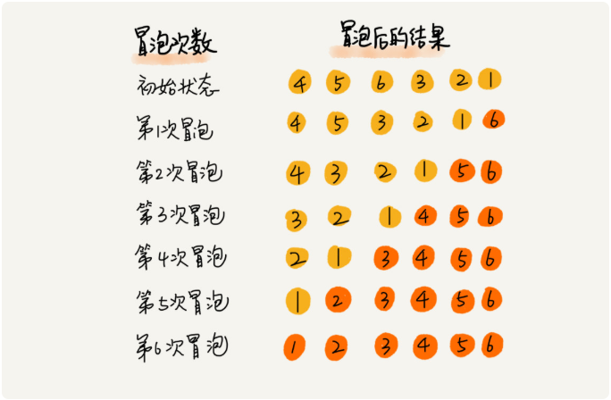
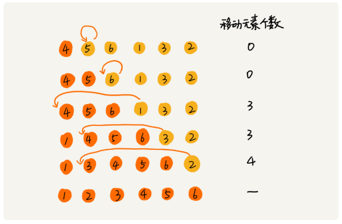
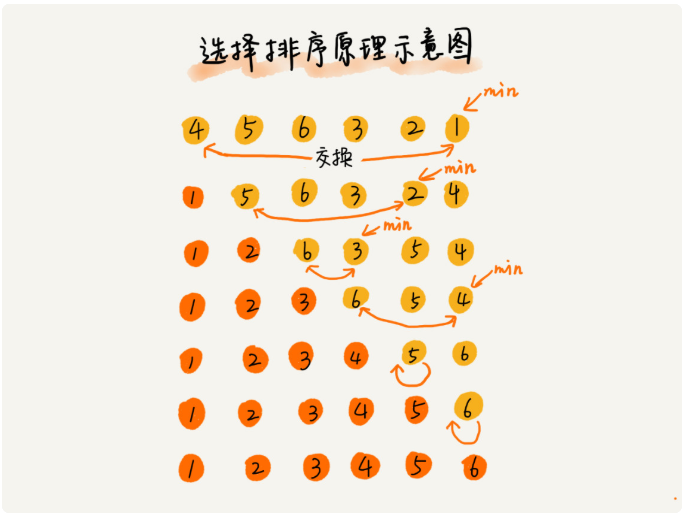
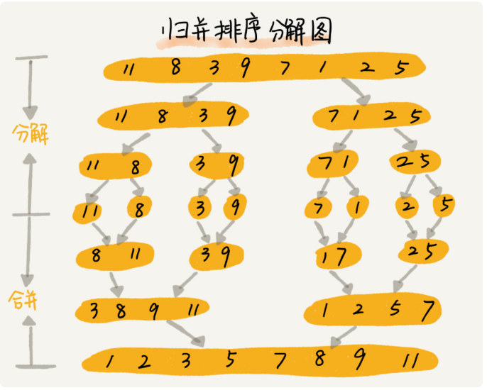
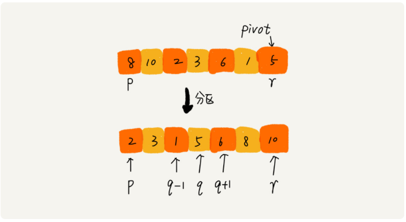

## 算法和数据结构学习笔记

### I.算法

1. 排序算法

   - 冒泡排序

     冒泡排序是基于比较和交换的排序算法。实现理论：使用两层嵌套循环，外层循环对应排序的轮数，内层循环用于比较相邻的两个元素大小，如果不满足大小次序则做交换操作。

     

     最好时间复杂度O(n)，最坏O(n^2)，平均最坏O(n^2)。是稳定的排序算法。

   - 插入排序

     插入排序是基于比较和移动的排序算法。排序的思想是，将数据分为两个区域：一个区域元素是有序的，另一个区域内元素则是待排序的。每次排序时，从无序的区域中选择元素并插入到有序的区域中。需要使用两层嵌套循环，外层对应需要插入的次数，内层用于选择应插入的位置。

     

     最好时间复杂度O(n)，最坏O(n^2)，平均最坏O(n^2)。是稳定的排序算法。

   - 选择排序

     选择排序时基于比较和交换的排序算法，数据分两个区域，有序的区域和待排序的区域。每次从待排区域中选出最小（大）的元素放到有序区的尾部。需要使用两层嵌套循环，外层用于控制排序轮数，内层用于在无序的区域选择最小（大）的元素。

     

     最好时间复杂度O(n^2)，最坏O(n^2)，平均最坏O(n^2)。是不稳定的排序算法，因为有可能改变值大小一样的元素相对位置。

   - 归并排序

     拆分为一个个元素之后，在合并的时候进行排序。合并的操作就是将两个有序的元素集合合并为一个。由于拆分为最小单元（一个元素）之后，两个元素之间可以看成为两个有序的集合，只不过是元素个数为一个。

     归并排序的重点在于合并的过程，需要借助额外的存储空间来将两个有序集合合并为一个。归并排序可以用递归写法来实现。

     

     最好、最坏、平均时间复杂度均为O(nlogn)。空间复杂度为O(n)，是稳定排序。

   - 快速排序

     快速排序的思想是从待排序的数据集合中选择一个元素V，根据这个元素的值，将数据分为两个或者三个部分，前者对应二路快排，后者对应三路快排。讨论二路快排的情况，元素被分为小于等于V和大于V两个区间，然后再对这两个区间分别进行快排。从快排的思想可以看出来，快排很可以很方便地用递归的方式写出来。

     

     最好时间复杂度为O(n)，最坏时间复杂度为O(n^2)，平均时间复杂度为O(nlogn)。不是稳定排序。

2. 

